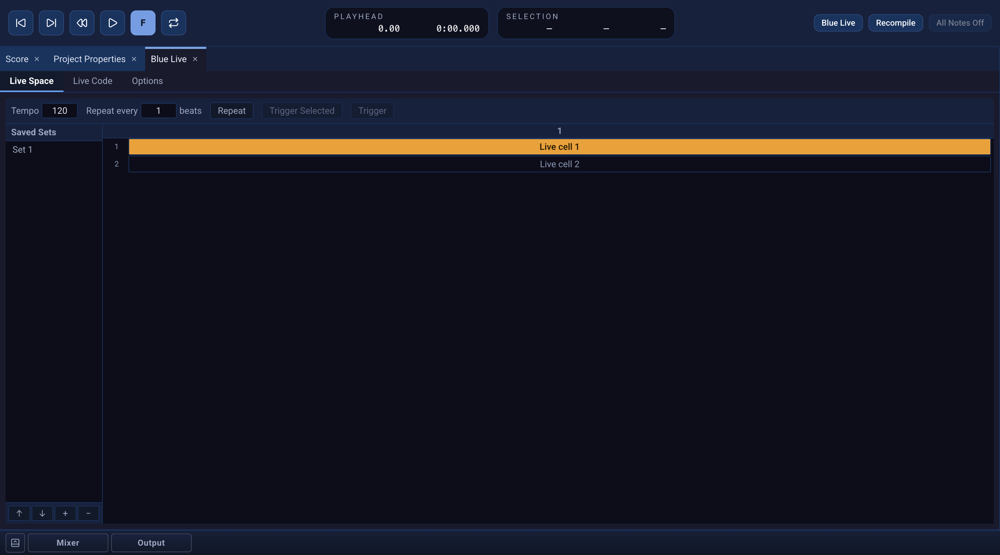

# Blue Live

**Blue Live** lets you trigger SoundObjects while a project runs in Csound.
Open the **Blue Live** panel from **Window → Editors**, then start the engine
with the **Blue Live** toolbar button. **Recompile** restarts it with the
current project, and **All Notes Off** releases sounding notes.

Blue Live uses the project's orchestra, instruments, tables, UDOs, mixer, and
Global Score. It does not play the main Score timeline. Keep long-running
effect notes in Global Score or use an always-on instrument. Changes to
orchestra code generally need **Recompile**; the Live Code editor also lets
you evaluate a line or block while Blue Live or realtime playback is running.

{fig-alt="Blue 3 Live Space showing tempo and repeat controls, a saved set, and two sample Live cells with the first selected."}

## Live Space

The **Live Space** tab is a grid of SoundObject cells. Right-click an empty
cell to add an available object, or copy and paste objects between the grid
and Score. Select a cell to edit its object. Double-click it to toggle its
enabled state; enabled cells are highlighted.

**Trigger Selected** sends the selected cell's generated notes to the
running engine. **Trigger** sends all enabled cells. With focus in Live
Space, use **Cmd/Ctrl+T** and **Cmd/Ctrl+Shift+T**, respectively. The
toolbar's **Tempo** value controls triggering. Blue Live applies the
object's Note Processors; inspect generated notes if their timing or
instrument is unexpected.

You can save and recall sets of enabled cells in the Live Space panel.
Set **Repeat** to the number of quarter-note beats between triggers, then turn
on the **Repeat** toggle to retrigger all enabled cells while Blue Live runs.
The interval is `Repeat × 60 ÷ Tempo` seconds. Tempo and Repeat edits take
effect without recompiling; disabling Repeat or stopping Blue Live cancels the
schedule. With no enabled cells, the scheduled trigger submits no score.

## MIDI input routing

The **Virtual Keyboard** panel's **Routing** selector applies to both the
Virtual Keyboard and enabled hardware MIDI inputs. In **Focused Target** mode,
new notes go to the focused Track or Orchestra assignment, regardless of the
input channel, when that assignment has an enabled instrument in the compiled
target list. Click a Track's timeline or layer row, or its instrument control,
to focus that Track. Select an Orchestra assignment row in Arrangement to focus
it. If no eligible target is focused, new notes are not sent to an instrument.

In **Direct Channel** mode, MIDI channel 1 routes to the first Orchestra
assignment, channel 2 to the second, and so on through channel 16 and the
sixteenth assignment. The assignment must be enabled and have an instrument.
Hardware MIDI uses the channel carried by each message; the Virtual Keyboard
uses its **Channel** value.

## Live Code and options

The **Live Code** tab stores Csound orchestra text with the project. While
Blue Live or realtime playback runs, **Cmd/Ctrl+Enter** evaluates the
current line or enclosing block. This is useful for trying orchestra
changes before recompiling the project.

The **Options** tab contains an optional Blue Live command line and an
override switch. Leave these at their defaults unless you need custom
Csound flags. See [Project Properties](project-properties.qmd) for the
project's regular realtime and disk render settings, and [Settings](settings.qmd)
for device configuration.

The older Java Blue manual describes an **SCO Pad** and a toolbar MIDI Input
toggle; those are not part of the current Blue 3 workflow. Java Blue and Blue 3
both preserve legacy key and MIDI trigger fields on Live cells for project
compatibility, but neither has an assignment UI or uses those fields to
trigger cells. Blue 3's MIDI input device preferences are configured
separately in [Settings](settings.qmd).
