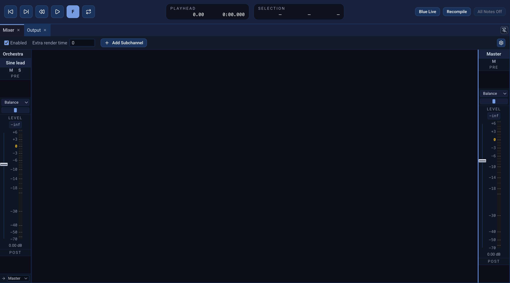

# Mixer

The **Mixer** panel controls a project's audio after its instruments and
tracks generate sound. Instrument channels appear under **Orchestra**;
track-associated channels have their own groups. Unlike many track-based
applications, a SoundObject layer is not bound to one instrument or mixer
channel: its objects can generate events for different instrument IDs.
The panel also shows user-created **Subchannels** and one **Master** strip.
Audio ultimately reaches Master, possibly through several subchannels.

{fig-alt="Expanded Blue 3 Mixer showing Enabled and Extra render time, Add Subchannel, Sine lead and Master strips, Pre and Post chains, pan, level faders and output routing."}

## Enable the mixer and route channels

The toolbar's **Enabled** checkbox controls this project's mixer. **Add
Subchannel** creates a bus for routing and effects. Right-click a subchannel
strip to **Remove SubChannel**; ordinary instrument and track channels are
associated with the project's instruments or tracks, rather than added from
that button. The output selector at the bottom of a non-master strip chooses
Master or another valid subchannel. Blue prevents routing cycles.

Each strip has **Mute** and, except for Master, **Solo** buttons, a level
fader, and an editable level readout. When the mixer is disabled, its strip
Mute and Solo controls cannot affect audio. Pan controls appear when panning
is enabled in Mixer Settings. Track headers in the Score can either edit the
associated channel's audio Mute/Solo state or filter events, according to
**Score settings → Track Layer M/S Mode**; see [Score](score.qmd).

An orchestra instrument that uses `blueMixerOut` sends its audio through its
instrument-ID channel when the mixer is enabled. To send directly to a named
subchannel, use the form below in Csound code, replacing the name with an
existing subchannel:

```csound-orc
blueMixerOut "Reverb Bus", aleft, aright
```

With the mixer disabled, Blue converts `blueMixerOut` to Csound `outc`. A
named subchannel must exist when the mixer is enabled. This routing form is
also useful for SoundObjects with generated instruments, such as
[AudioFile](audio-file.qmd).

## Effects and sends

Every strip has a **Pre** chain before its level fader and a **Post** chain
after it. Right-click either chain for **Add New Effect** or **Add Send**.
Double-click an effect entry to open its interface; its context menu also
provides **Edit Effect Definition**, enable/disable, reorder, duplicate,
copy, cut, paste, and remove actions. You can open **Tools → Effects Library**
to browse effects in the Libraries panel, copy an effect there, and paste it
into a Pre or Post chain.

A **Send** taps audio at its position in the chain and sends it to another
valid channel while the strip's normal output route remains in place.
Double-click a send, or choose **Open Editor for Send**, to select its target
and **Amount** from 0 to 1. A Pre send taps the signal before the fader; a
Post send taps it afterward. The target choices prevent a routing loop.

For example, route a dry instrument channel to Master, add a subchannel for
reverb, and put a Send in the instrument's Post chain targeting that
subchannel. Put the reverb effect on the subchannel and route the subchannel
to Master. Adjust the send amount to change how much of the instrument
reaches the reverb bus.

## Project mixer settings

When the mixer is enabled, the toolbar's **Extra render time** adds time after
the score for effect tails such as reverb to finish. **Mixer Settings**
controls meter display and panning for the current project, including whether
panning is enabled,
its pan law, and off-center boost. Those settings persist in the project.
The **Project Defaults → Mixer Enabled** application preference only chooses
how a new project starts; it does not replace the current project's Enabled
checkbox.
