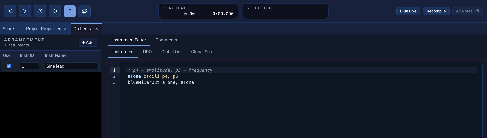

# Orchestra and instruments

The **Orchestra** panel contains the current project's instrument
**Arrangement** and the editor for the selected instrument. A Csound score
event refers to an instrument by its **Instr ID**; the
[First project](first-project.qmd) tutorial pairs `i1` with instrument ID `1`.
The visible instrument name helps you organize the project, while the ID
connects it to generated score events. The personal instrument collection
lives in a separate **Libraries** panel.

{fig-alt="Blue 3 Orchestra showing the Arrangement on the left and the selected Sine lead Generic Instrument code on the right."}

## Organize the project Arrangement

Open **Orchestra** from **Window → Editors** if the panel is hidden. Click
**+ Add** and choose an instrument type. Blue 3 offers **Generic Instrument**
for Csound code, plus Python Instrument, JavaScript Instrument, BlueX7, and
BlueSynthBuilder. These types have different editors and runtime needs.

The **Arrangement** table has **Use**, **Instr ID**, and **Instr Name**
columns. Clear **Use** to exclude that assignment from the generated
orchestra. Edit **Instr ID** to match the score events that should call it;
IDs may be numbers or names. **Instr Name** is a descriptive label. Click a
row to edit its instrument on the right. Drag the divider to give the
Arrangement or editor more room.

Right-click a row for **Enable/Disable**, **Add Instrument**, **Copy**,
**Cut**, **Paste**, **Import…**, **Export…**, and **Remove**. The same menu can
**Replace with Generic** or **Convert Generic to BSB**. Import inserts an
instrument after the selected row; Export saves that assignment for reuse.
Paste inserts a copied instrument after the row. Removing an assignment
removes it from the project Arrangement, so score events still using its ID
will need another instrument.

## Edit an instrument

A Generic Instrument has **Instrument**, **UDO**, **Global Orc**, and **Global
Sco** tabs. Put the instrument body in **Instrument** without `instr` or
`endin`; Blue adds those lines when generating a CSD. The other tabs are for
embedded user-defined opcodes and additional global orchestra or score text.
The selected instrument also has a **Comments** tab. Other instrument types
have their own editors; see [Instrument types](instruments.qmd) for their
current controls and runtime requirements.

## Unavailable instrument types and runtimes

An instrument type that Blue 3 does not recognize appears as an unsupported
instrument. Its original XML is retained when you save or copy the project.
CSD generation reports the unsupported type while its **Use** setting is
checked. Clear **Use** to exclude it temporarily, or replace it with a
supported instrument when you have the code needed to reproduce its sound.

Python instruments also require the Java runtime. If Java is unavailable,
CSD generation reports the runtime error; the instrument remains in the
project so you can correct the runtime setup and try again.

## Reuse an instrument from Libraries

Open **Libraries** from **Window → Properties** and select **Instruments** in
its type filter. **User Libraries → Instruments** is a personal collection
available across projects. Create folders to organize it; right-click an
entry to duplicate, copy, cut, paste, rename, reorder, import, export, or
delete as applicable. You can rename a user-library entry by double-clicking
its name or selecting it and pressing **F2**. Search the panel to find an
instrument by name.

To keep a project instrument for later use, drag its Arrangement row to the
user Instruments root or a folder in Libraries. You can also **Copy** the
Arrangement row and **Paste** it into a user-library folder. To use a library
instrument in the current project, drag it onto the Arrangement or copy it
in Libraries and paste after an Arrangement row. The resulting project entry
has its own **Instr ID** and **Use** setting; check both before playing the
score. The user-library and project editors are separate, so check which
entry you selected before editing.

## Connect an instrument to the score

The first field of a Csound `i` event names an instrument. For `i1`, ensure
the intended Orchestra row has **Instr ID** `1` and **Use** is enabled. The
remaining score fields are values the instrument reads as `p` fields. For
example, a Generic Instrument can use `p4` for amplitude and `p5` for
frequency, as in the tutorial.

Use **Project → Generate CSD to Screen** to inspect the assembled instrument
and events before rendering. If the event calls the wrong instrument, check
its `i` number against **Instr ID**. For output options and playback, see
[Rendering](rendering.qmd); for placing events, see [Score](score.qmd).
For code shared across instruments, see [Global Orchestra and Global Score](globals.qmd)
and [UDOs](udos.qmd). [Tables](tables.qmd) covers project-wide Csound function
tables.
