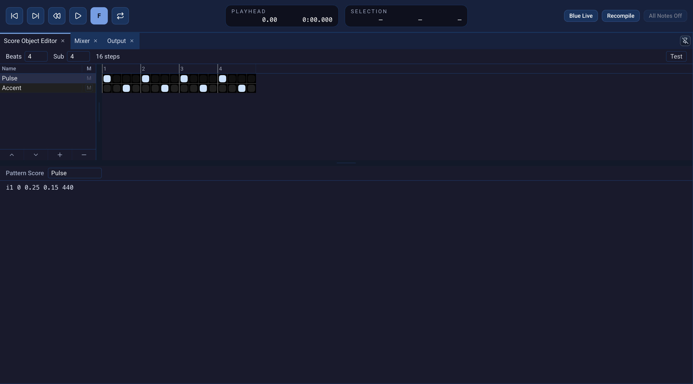

# PatternObject

**PatternObject** is a step grid for triggering short Csound score phrases.
Each row has its own score text; each active cell starts that phrase at a
subdivision of a beat. It is useful for repeated rhythms, pulses, and
layered figures. It is a SoundObject on the main [Score](score.qmd), distinct
from a Score **Pattern layer**.

{fig-alt="Expanded Blue 3 PatternObject editor with four beats, four subdivisions, Pulse and Accent rows, enabled grid steps, and Pattern Score text below."}

## Build a simple pattern

1. Right-click a SoundObject layer and choose **Add SoundObject →
   PatternObject**. Double-click the object to open its editor.
2. Set **Beats** to `4` and **Sub** to `4`. The editor shows 16 steps, four
   subdivisions per beat. Set these values before filling the grid so each
   trigger has the intended beat position. Changing **Beats** keeps triggers
   in the steps that remain visible; shortening the grid removes later
   triggers, and expanding it adds empty steps. Changing **Sub** clears the
   grid because the old step positions no longer represent the same times.
   Use **Test** to check the result after resizing.
3. Click **+** under the pattern list to add a row. Give the row a useful
   name in **Pattern Score** and enter a short score phrase starting at local
   time zero, for example:

   ```csound-sco
   i1 0 0.25 0.15 440
   ```

   This uses instrument ID `1` and the `p4` amplitude, `p5` frequency order
   from [First project](first-project.qmd).
4. Click cells in the row to turn triggers on or off. With four subdivisions
   per beat, steps 1, 5, 9, and 13 trigger the phrase at beats 0, 1, 2, and 3.
   Drag across cells to fill or clear several at once.
5. Click **Test** to inspect the generated score, then use **Project →
   Generate CSD to Screen** to see it with the rest of the project.

The score text is copied at each enabled cell's time. If a row's phrase lasts
longer than one subdivision, its notes may overlap phrases triggered by later
cells. The grid marks trigger positions, not the full duration of every
generated note.

## Work with rows and duration

Add rows for other phrases or instruments. Select a row to edit its name and
**Pattern Score**. The **M** control mutes a row without deleting its grid.
The controls below the list move a selected row up or down, add a row, or
remove one. A muted row remains in the project but generates no notes while
muted.

A new PatternObject has **Repeat** time behavior. Stretching its visible
width can therefore repeat its generated material. Open **Score Object
Properties** to choose **Repeat**, **Scale**, or **None**, and set a repeat
point when a specific loop interval matters. Blue 3 uses the configured
**Beats** length as the source length for Scale and Repeat, even when the last
steps are empty. Thus a four-beat grid with triggers only in its first two
beats retains its quiet tail when repeated at a four-beat interval. A phrase
that extends past a cycle boundary can be clipped by Repeat. Inspect **Test**
or generated CSD when the apparent grid length and audible phrase differ. See
[SoundObjects](soundobjects.qmd) for time behavior and [Time](time.qmd) for
beats, subdivisions, and snap.

For directly written events without a step grid, use
[GenericScore](generic-score.qmd). For drawn pitched notes, use
[PianoRoll](piano-roll.qmd).
