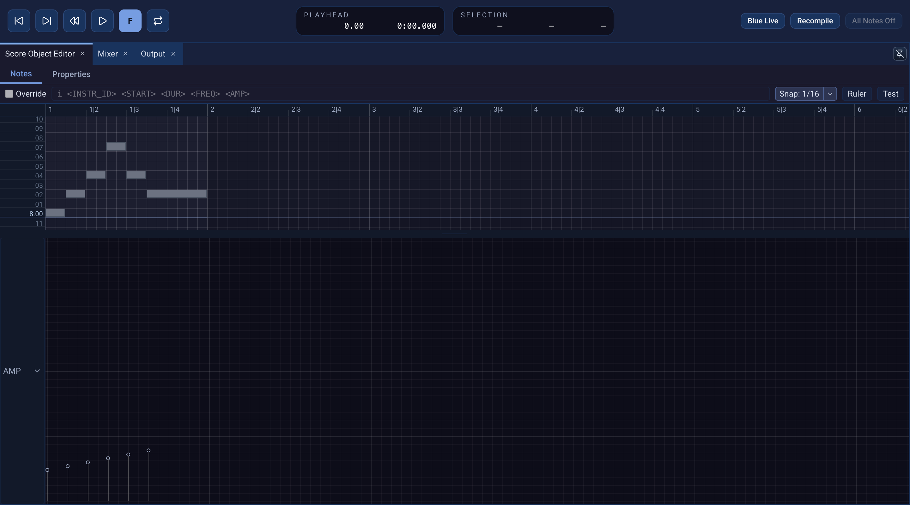

# PianoRoll

**PianoRoll** is a [SoundObject](soundobjects.qmd) for drawing pitched notes.
Its horizontal axis is time; its vertical axis is pitch. Unlike a fixed MIDI
roll, its note template lets you decide which Csound `p` fields receive pitch,
amplitude, or additional values.

{fig-alt="Expanded Blue 3 PianoRoll Notes editor with a six-note melody, note-template tokens, local snap and ruler controls, and an AMP field graph below."}

## Set up a roll for an instrument

Right-click a SoundObject layer in the [Score](score.qmd) and choose
**Add SoundObject → PianoRoll**. Double-click the object, then open its
**Properties** tab before drawing notes.

**Instrument ID** must match an enabled row in the [Orchestra](orchestra.qmd).
The **Note Template** turns each drawn note into a Csound score event. A new
PianoRoll uses:

```text
i <INSTR_ID> <START> <DUR> <FREQ> <AMP>
```

`<START>` and `<DUR>` come from the drawn note; `<FREQ>` comes from its pitch;
`<AMP>` comes from the AMP field. Spaces between template values matter.
Template tokens are replaced for each note; literal numbers and other score
text pass through. For example, `<FREQ><FREQ>` would concatenate two pitch
values into one field. Select a single note in the **Notes** tab and enable
**Override** above the canvas if it needs a different template; turn the
override off to use the roll's template again.

Because the [First project](first-project.qmd) instrument expects amplitude
in `p4` and frequency in `p5`, change the template to:

```text
i <INSTR_ID> <START> <DUR> <AMP> <FREQ>
```

Keep **Instrument ID** at `1` for that project. In **Additional Fields**, set
the AMP row's **Default** to `0.15` *before drawing new notes*; its original
default is `1`. Existing notes keep their own field values, so adjust those
in the field editor if you changed the default after drawing. This makes the
roll's generated events use the same `p` field order and level as the
first-project GenericScore.

## Draw and edit notes

Open the **Notes** tab. Hold **Shift** and drag on empty space to create a
note; horizontal movement sets its duration. Click a note to select it, drag
its body to move it, or drag an edge to resize it. Drag on empty space without
Shift for a marquee selection. Shift-click adds or removes an individual note
from the selection. Select notes and press **Delete** to remove them.

To duplicate a phrase, select its notes and use **Copy** (Command-C on macOS,
Control-C elsewhere), then Command-click empty canvas on macOS or
Control-click on Windows and Linux where the copied phrase should start.
**Cut** uses Command-X or Control-X. The canvas context menu also has Copy,
Cut, Paste, Remove, and Select All. A paste uses the clicked time and pitch
as the placement target. Command-A or Control-A selects all notes when focus
is in the note editor.

Copy and paste preserve note positions, lengths, pitches, field values, and
any note-specific **Override** template. A pasted note keeps its own `p`
field order when that override is enabled.

The **Snap** control sets note placement; the **Ruler** button configures the
local time display. The PianoRoll can use the Score's ruler settings or its
own primary and secondary formats. See [Time](time.qmd) for the distinction
between display, snap, and stored positions.
Click the main Snap button to enable or disable snapping; use its arrow menu
to choose musical, triplet, time, sample, or SMPTE divisions. The Ruler dialog
can inherit the Score settings or use local primary and optional secondary
rulers. The visible ruler format does not itself change the snap value.

Below the note canvas, choose a field such as AMP and edit its values for the
selected notes. The **Properties** tab's **Additional Fields** table lets you
add custom fields with a name, continuous or discrete type, bounds, and a
default. Put a matching `<FIELD_NAME>` token in the Note Template to send
that value to the instrument. Renaming a field preserves its values; removing
one removes its note data.

New notes receive each field's current default. Adding a field also gives
existing notes its initial default; changing that default later does not
rewrite their stored values. Changing a field's bounds clamps its note values
to the new range, and a discrete field uses whole-number values. To edit
values, choose the field below the canvas and drag a note's value handle
vertically. You can also hold Control or Command and drag a selected note on
the canvas vertically to change the selected field.

## Pitch and generated score

**Pitch Generation** chooses what `<FREQ>` emits: frequency in hertz, Blue
PCH, or MIDI note number. Frequency is the default and matches the
first-project oscillator. Choose another mode only when the instrument or a
[Note Processor](note-processors.qmd) expects it. **Scale** starts at 12-tone
equal temperament and can load a Scala scale; **Transposition** shifts notes
by scale degrees.

The scale's **Base Frequency** sets its frequency reference for hertz
generation. New scales use Middle C (C4 in scientific pitch notation), about
261.625565 Hz, as their base. Edit this value in PianoRoll **Properties**;
press Enter or leave the field to commit. Invalid input restores the previous
value, and negative values are clamped to zero.

Click **…** beside Scale to load a `.scl` file. Right-click the scale name to
restore 12-tone equal temperament. In MIDI pitch mode, `<FREQ>` emits MIDI
note numbers and the editor uses the standard 12-note MIDI pitch grid rather
than the loaded scale.

Click **Test** in the Notes tab to inspect this roll's generated score. Then
use **Project → Generate CSD to Screen** to inspect it in the full project.
Check the instrument ID, field order, and note values before rendering.

A new PianoRoll has **Repeat** time behavior and a four-beat repeat point. If
you stretch it on the Score, review **Time Behavior** and **Repeat Point** in
Score Object Properties so the result matches the phrase you intend. See
[SoundObjects](soundobjects.qmd) for the broader timing rules.

## Editor shortcuts

With focus in the note editor, **Alt-S** toggles snap. Command or Control
with **+** or **−** changes horizontal zoom; Command or Control with the up or
down arrow changes note-row height. Text inputs keep their normal editing
shortcuts.
