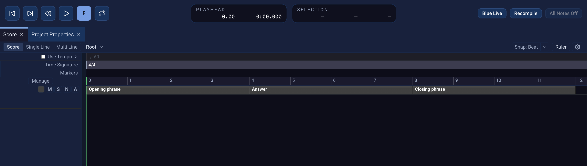

# Score timeline

The **Score** panel arranges a project in time. A new project starts with a
SoundObject layer; [First project](first-project.qmd) uses it to place a
GenericScore event. Each layer group has controls on the left and a timeline
on the right. The ruler above the timeline shows positions and snap divisions.

{fig-alt="Blue 3 Score with transport controls, root navigation, ruler and snap controls, and three GenericScore phrases."}

## Choose a view and navigate the score

The Score toolbar offers **Score**, **Single Line**, and **Multi Line** views.
The path beside those buttons shows the score container you are editing.
When you open a [PolyObject](polyobjects.qmd), choose an earlier segment in
that path to return to its parent or to the root score. The same toolbar has
**Snap**, **Ruler**, and **Score settings** controls. [Time](time.qmd) explains
ruler formats, snap values, and whether changing a ruler also converts stored
positions.

## Layer groups and their contents

Use **Manage** at the top of the layer headers to open **Score Manager**.
Its **Add Layer Group** button offers three kinds:

| Group | Use it for |
| --- | --- |
| **SoundObject Layer Group** | Arrange [SoundObjects](soundobjects.qmd) and their parameter automation. A layer is not tied to one instrument or mixer channel. |
| **Track Layer Group** | Arrange SoundObjects and **AudioClips** on tracks with associated mixer channels. Drag an audio file from the operating system or Blue's File Manager onto a track, or use **Add AudioClip** on its timeline. An [AudioFile SoundObject](audio-file.qmd) is a separate object workflow. |
| **Patterns Layer Group** | Trigger a layer's source SoundObject from a grid. See [PatternObject](pattern-object.qmd) for another grid-based way to create a repeated figure. |

Score Manager has group controls on the left and layers for the selected group
on the right. Select a group to add, remove, or move it; select one of its
layers to add, remove, move, or rename that layer. Double-click a group or
layer name to edit it. Removing a group or layers asks for confirmation.

For quick edits in the Score, double-click the spacer below a group to add a
layer, or right-click it for **Add Layer** and group move commands. Click a
layer header to select it; Shift-click extends the selection, including across
groups. Right-click a selected header for layer commands such as adding,
removing, moving, and changing height. Double-click a layer name to rename it.
If a removal would empty a group, the confirmation offers a choice about
deleting that empty group.

## Work on the timeline

Right-click empty space on a SoundObject or Track layer and choose **Add
SoundObject**. Track layers also offer **Add AudioClip**. Select an item to
move or resize it, and double-click to open its editor. An item's context
menu provides arrangement actions such as **Align**, **Shift**, **Copy**,
**Cut**, and **Remove**. The [SoundObjects](soundobjects.qmd) chapter explains
what an object produces and how its position and duration affect the result.

An AudioClip can be moved and trimmed on a Track layer. Its fade handles
adjust fade-in and fade-out duration; right-click a fade area to select its
fade type. **Alt-drag** an AudioClip's body to slide the source audio within
its existing Score interval without moving the clip. The File Start field
in its editor shows that source offset. Blue 3 has no dedicated split-clip
command in the current Track-layer canvas; make two clips and trim them for
separate segments. Track layers can route audio through the [Mixer](mixer.qmd).

Patterns layers use cells to place repeated triggers. Open the source
SoundObject from the layer header to change the material those cells play.
Click or drag across cells to toggle a row's triggers; the row's context menu
offers selection and clipboard actions for a pattern shape.

## Track-header Mute and Solo

Open **Score settings** from the toolbar to choose **Track Layer M/S Mode**:

- **Audio** controls the associated mixer channel's Mute and Solo state. It
  affects that channel's audio when the mixer is enabled.
- **Event** filters score events on the track layer before rendering. This is
  also the effective behavior when the mixer is disabled.

The two modes retain separate saved states. Switching modes changes which
state the header buttons edit; it does not convert one state into the other.
If Audio mode is selected but the track has no associated mixer channel, its
header reports that the audio control is unavailable rather than changing the
Event state.
Other SoundObject layers use event Mute and Solo. The Mixer strip has its own
Mute and Solo buttons for audio routing; see [Mixer](mixer.qmd).

## Timeline rows, time, and playback

Right-click a row header above the layers to show or hide the **Tempo**,
**Time Signature**, and **Markers** rows. The tempo header has **Use Tempo**
and an expand/collapse control. Double-click the tempo region bar to add or
edit a point. Its context menu can edit a point, select a **Constant** or
**Linear** curve, or delete a later point. Double-click a time-signature
region to add or edit a change; its context menu can edit or delete a later
change. The [Time](time.qmd) chapter explains how these maps affect musical
positions and rulers.

The application transport provides play and stop, marker navigation, rewind,
follow-playback, and loop controls. The **Playhead** display shows playback
time; the **Selection** display shows render start, render end, and selection
duration. Right-click either display to choose its time format. Use
**Project → Add Marker** to place a marker. A render selection limits the
portion sent to Csound; [Rendering](rendering.qmd) explains realtime and disk
output.

For object editing, start with [GenericScore](generic-score.qmd) for written
Csound events, [PianoRoll](piano-roll.qmd) for drawn notes, and
[PatternObject](pattern-object.qmd) for a trigger grid. [PolyObjects](polyobjects.qmd)
nest a Score inside an object; [Note Processors](note-processors.qmd) transform
generated notes at object, layer, group, or Score scope. To reuse a phrase,
see [SoundObject Library](soundobject-library.qmd) and [Instance](instance.qmd).
