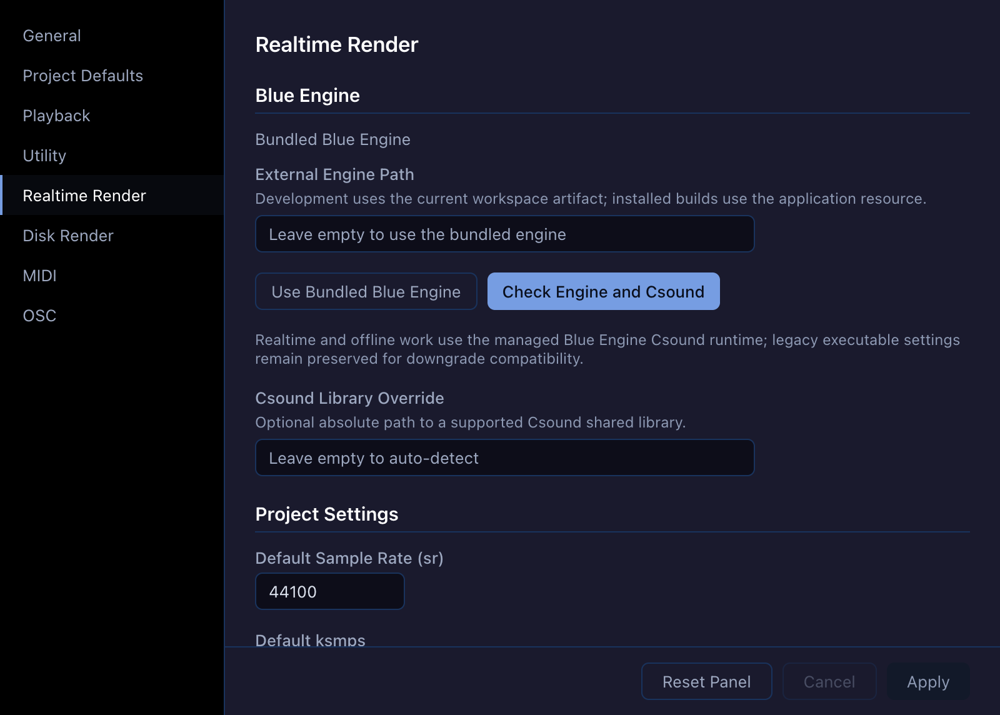

# Settings

Open **Settings…** from the **Blue** menu on macOS or the **File** menu on
Windows and Linux. Select a section in the left sidebar, edit its values, and
click **Apply**. **Cancel** discards unapplied edits; **Reset Panel** restores
the selected section's defaults. If you close the window with unapplied edits,
Blue asks whether to save them.

These are application preferences. For settings stored with the open project,
use **Project Properties** instead. Project Defaults affect newly created
projects, not projects that already exist.

{fig-alt="Blue 3 Settings window with the sidebar sections and Realtime Render selected, showing bundled-engine controls and empty optional engine and Csound library overrides."}

## General and project defaults

**General** sets the default **Work Directory** for file choosers and imports
or exports. **Csound Manual URL** accepts an HTTPS or local `file:` base URL;
its own **Reset** button restores the default. The section also controls new
user defaults, message colors, Csound error warnings, and the number of
temporary files per directory.

In **Project Defaults**, choose the author, whether the mixer starts enabled,
the default **Track Layer** or **SoundObject Layer** group, layer height, and
UDO style for new projects. The same section sets the initial primary and
optional secondary ruler, snap state and value, and SMPTE frame rate. The
ruler changes what the timeline displays; snap controls placement. See
[Time](time.qmd) before changing an existing project's time settings.

## Playback and utilities

**Playback** controls the playhead animation rate, a display-only latency
correction in seconds, **Score Follows Playback**, and whether following is
enabled when rendering starts.

**Utility** contains freeze flags and the maximum number of concurrent freeze
jobs. Freeze rendering and SoundFont inspection use the managed Blue Engine
Csound runtime. A legacy Csound executable preference may remain in saved
settings for compatibility with older versions of Blue; it is hidden and does
not select the current Blue Engine runtime.

## Realtime Render

The **Blue Engine** section normally uses the engine bundled with Blue. Leave
**External Engine Path** empty, or click **Use Bundled Blue Engine**, unless
you have a separate compatible engine to run. **Check Engine and Csound**
reports whether Blue can load the selected engine and Csound library. Leave
**Csound Library Override** empty for automatic discovery; an absolute path
can select a supported shared library when necessary.

**Project Settings** supplies defaults for sample rate (`sr`), control period
(`ksmps`), channel count (`nchnls`), and `0dbfs`. The **Audio** and **MIDI**
subsections choose Csound runtime modules and input/output devices. Enable
the driver and the required input or output, choose a module, then select a
device. Blue loads the available modules and devices for the selected runtime;
use **Rescan Audio Devices** or **Rescan MIDI Devices** after connecting or
disconnecting hardware. Choose a discovered device from the field's list, or
enter its exact Csound device identifier; a saved or custom identifier remains
editable even when the selected module does not report it. A saved module that
is unavailable is identified in the status line.

**Buffer Settings** independently enable software and hardware buffer sizes.
When enabled, Blue passes them to Csound as the realtime `-b` (software) and
`-B` (hardware) options.
**Message Level** selects note amplitude, out-of-range, warning, and
benchmark messages. **Other Settings** can disable displays and supply
additional Csound command-line options. See [Rendering](rendering.qmd) for
starting and stopping playback.

## Disk Render

**Disk Render** supplies defaults for sample rate, `ksmps`, `nchnls`, and
`0dbfs` for offline output. **File Output Settings** can enable a chosen file
format and sample format, save peak information, dither output, and rewrite
the header while rendering. The section also has its own message-level and
advanced Csound options.

**Render to Disk and Play** opens the finished file in Blue's Audio File
Player. **Render and Open Command** can run an external command with
`$outfile` standing for the rendered file; its default opens the file's
folder. The older external **Render and Play Enabled** and **Render and Play
Command** preferences are retained in saved settings for compatibility but
are not shown because the current play action uses Blue's player. Disk
rendering itself uses the managed Blue Engine Csound
runtime. See [Rendering](rendering.qmd) for the project commands and output
workflow.

## MIDI and OSC

The **MIDI** section lists live MIDI _input_ devices and their availability and
connection state. Enable the controllers Blue should use, then click
**Apply** to save the preference. **Rescan** refreshes discovery after a
device change without changing the saved preference. This input-device list
is separate from the Csound MIDI module and device choices in **Realtime
Render**.

In **OSC**, set **Preferred Server Port** to a whole UDP port number from 1 to 65535. The panel shows whether Blue is listening and the **Active port**. If
the preferred port is busy, Blue scans upward for an available port; the
saved preference stays the same. The **Supported OSC Messages** table lists
the accepted address prefixes. Message arguments and bundle timetags are
ignored. Blue listens on all IPv4 interfaces without authentication, so use
OSC on a trusted network and control access with the host firewall.
