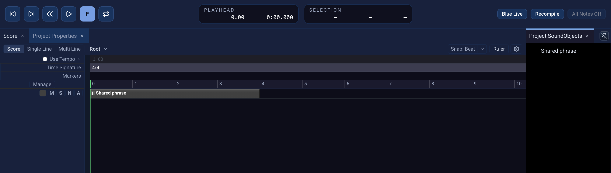

# SoundObject Library

Use **Project SoundObjects** when several places in one project should share
the same musical source. A definition lives in the project library; an
[Instance](instance.qmd) on the [Score](score.qmd) refers to it. Editing the
definition changes the material generated by its linked Instances. The
separate **Libraries** panel stores reusable SoundObjects for other projects.

{fig-alt="Blue 3 Score with a linked Shared phrase Instance and its source entry in the Project SoundObjects panel on the right."}

## Add an object to the project library

1. Create and edit a SoundObject on a SoundObject layer. For example, write a
   phrase in [GenericScore](generic-score.qmd).
2. Select that one object, right-click it, and choose **Add to Project
   SoundObjects**.
3. Open **Window → Properties → Project SoundObjects** to find the new
   definition. The object on the Score has been replaced with a linked
   Instance at the same position.

Select a definition in **Project SoundObjects** to open its editor. After
changing the source, use the editor's **Save** action. Linked Instances use
the revised source when Blue next generates the score. The definition is
saved with the project, rather than in your user-wide library.

## Place another copy

Drag a definition from **Project SoundObjects** to a compatible SoundObject
layer, or copy it in the panel and paste on the Score. When Blue offers a
choice, **Copy Instance** keeps the new object linked to the project
definition. **Copy Independent** makes an editable copy whose later changes
do not affect the definition or other Instances. You can also copy and paste
an existing Instance on the Score to make another linked placement.

Use [Instance](instance.qmd) for the placement and processing details. A
shared source is useful for a recurring motive or drum pattern; independent
copies are useful when a variation should develop separately.

Deleting a project definition also removes its linked Score Instances. Blue
shows their count in the confirmation dialog. The deletion is recorded in
project history, so **Edit → Undo** can restore it while the project remains
open. Check the listed instances before confirming.

## Reuse an object in another project

Open **Window → Properties → Libraries**. Under **User Libraries**, expand
**SoundObjects**. Copy a SoundObject from the Score, then paste it into that
root or a folder in the user library. You can organize user-library entries
in folders and use them in other projects.

Dragging or pasting a user-library SoundObject into a project creates an
independent copy. To make several linked Instances *within* that project,
first add the copy to **Project SoundObjects**. A user-library item is not a
live shared definition across projects.
