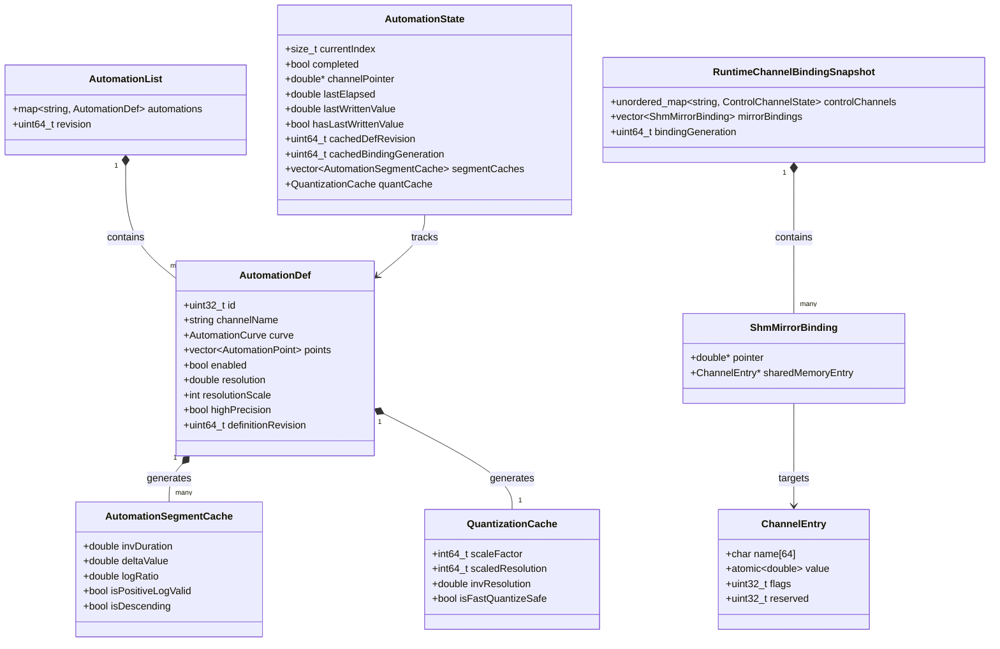
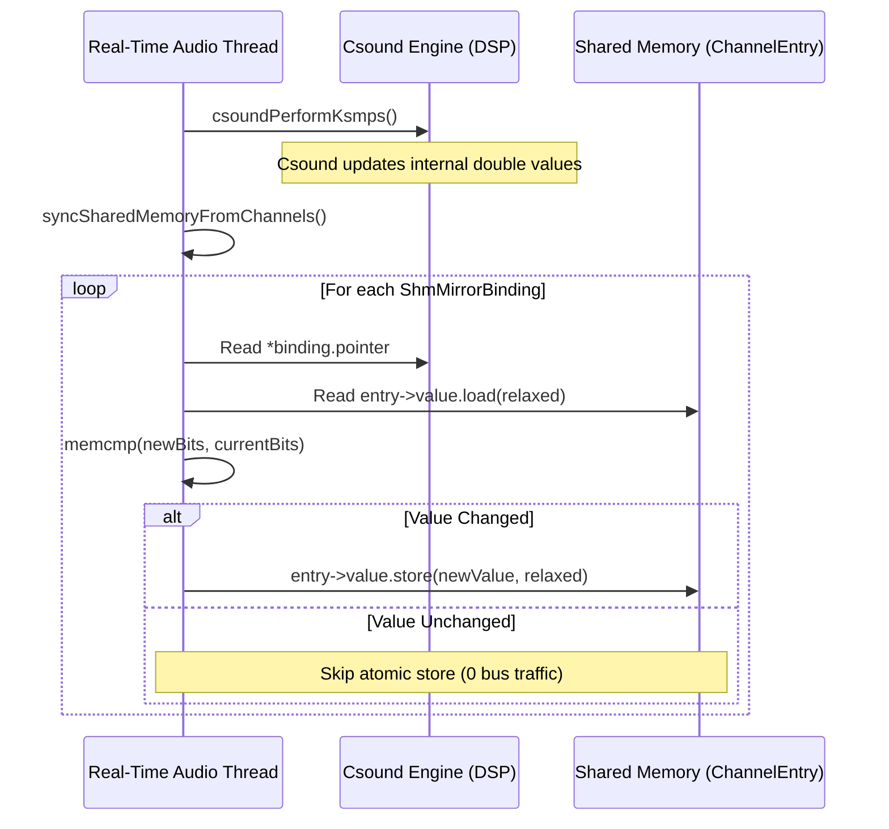

# Data Model: Blue Engine Host Performance and Real-Time Safety

**Feature**: `072-blue-engine-performance`  
**Date**: 2026-08-13  
**Status**: Complete  

---

## 1. Domain Entities & Memory Architecture

---

## 2. Entity Details & Field Specifications

### 2.1 Benchmark Entities

#### `BenchmarkScenario`
Defines a single reproducible test configuration for the Release benchmark harness.
- **`name`** (`std::string`): Unique identifier (e.g., `static_channels_256`, `exp_automation_128`).
- **`channelCount`** (`uint32_t`): Number of mirrored control channels (0, 1, 32, 128, 256).
- **`channelChangePattern`** (`ChannelPattern`): `STATIC` (no value changes) vs `CONTINUOUS` (mutated each k-cycle).
- **`automationCount`** (`uint32_t`): Number of active automation curves.
- **`automationCurve`** (`AutomationCurve`): `LINEAR`, `EXPONENTIAL`, `STEP`.
- **`quantizationMode`** (`QuantizationMode`): `NONE`, `FAST_DOUBLE`, `HIGH_PRECISION_FIXED`.
- **`isCompletedWorkload`** (`bool`): If true, points are in the past so envelopes start in completed state.
- **`liveEditFrequencyHz`** (`double`): Frequency of live ZMQ updates (e.g., 30.0 Hz) during playback.
- **`warmupCycles`** (`uint32_t`): Initial unmeasured control periods (default: 1,024).
- **`measurementCycles`** (`uint32_t`): Measured control periods per trial (default: 4,096).
- **`trialCount`** (`uint32_t`): Independent runs per scenario (default: 5).

#### `BenchmarkResult`
Recorded timings and spike observations for a single trial.
- **`scenarioName`** (`std::string`): Associated scenario identifier.
- **`trialIndex`** (`uint32_t`): 0-indexed trial sequence.
- **`automationAvgUs`** (`double`): Mean duration of `AutomationManager::process()` per k-cycle.
- **`automationP95Us`** (`double`): 95th percentile duration of `AutomationManager::process()`.
- **`automationMaxUs`** (`double`): Maximum duration observed in measurement window.
- **`automationSpikeCount`** (`uint64_t`): Number of k-cycles where automation duration exceeded 500 µs.
- **`shmAvgUs`** (`double`): Mean duration of `syncSharedMemoryFromChannels()` per k-cycle.
- **`shmP95Us`** (`double`): 95th percentile duration of `syncSharedMemoryFromChannels()`.
- **`shmMaxUs`** (`double`): Maximum duration observed for shared memory sync.
- **`shmSpikeCount`** (`uint64_t`): Number of k-cycles where SHM duration exceeded 500 µs.
- **`hostCycleAvgUs`** (`double`): Mean total Blue host overhead (`auto + shm + loop overhead`).
- **`hostCycleP95Us`** (`double`): 95th percentile total Blue host overhead.
- **`hostCycleMaxUs`** (`double`): Maximum total Blue host overhead.
- **`hostCycleSpikeCount`** (`uint64_t`): Number of k-cycles where host overhead exceeded 1,000 µs.
- **`performKsmpsAvgUs`** (`double`): Csound DSP execution duration (isolated from host overhead).

#### `PerformanceBaseline`
Machine-readable summary of baseline trials against which candidate optimizations are evaluated.
- **`metadata`**: Compiler version, optimization flags (`-O3`), target OS, CPU architecture, sample rate, ksmps.
- **`scenarioSummaries`**: Median trial results for each scenario.

---

### 2.2 Automation Model

#### `AutomationDef` (Immutable Definition)
- **`id`** (`uint32_t`): Unique automation ID.
- **`channelName`** (`std::string`): Target Csound control channel name.
- **`curve`** (`AutomationCurve`): Interpolation curve (`STEP`, `LINEAR`, `EXPONENTIAL`).
- **`points`** (`std::vector<AutomationPoint>`): Chronologically sorted envelope points.
- **`enabled`** (`bool`): Active flag.
- **`resolution`** (`double`): Quantization step size (`0.0` = none).
- **`resolutionScale`** (`int`): Decimal scale for high-precision quantization.
- **`highPrecision`** (`bool`): Enable bounded fixed-point mode matching the accepted Java Blue quantization fixtures; this is not arbitrary-precision `BigDecimal`.
- **`definitionRevision`** (`uint64_t`): **NEW.** Monotonically increasing revision incremented when definition properties change.

#### `AutomationSegmentCache` (Derived Invariant State)
- **`invDuration`** (`double`): Precalculated `1.0 / (p1.time - p0.time)` (0.0 if degenerate).
- **`deltaValue`** (`double`): Precalculated `p1.value - p0.value`.
- **`logRatio`** (`double`): Precalculated `std::log(p1.value / p0.value)` (valid when `p0 > 0` and `p1 > 0`).
- **`isPositiveLogValid`** (`bool`): True if exponential segment endpoints permit logarithmic ratio calculation.
- **`isDescending`** (`bool`): True if `p1.value < p0.value` (used for quantization bias).

#### `QuantizationCache` (Derived Invariant State)
- **`scaleFactor`** (`int64_t`): `10^resolutionScale` precomputed via lookup table for scales 0 through 18.
- **`scaledResolution`** (`int64_t`): Integer-scaled resolution for fixed-point math; zero or out-of-range values disable quantization for that definition.
- **`invResolution`** (`double`): Fast-path reciprocal step size.
- **`isFastQuantizeSafe`** (`bool`): True if resolution is suitable for reciprocal multiplication.

#### `AutomationState` (Real-Time Runtime State)
- **`currentIndex`** (`size_t`): Active envelope segment index.
- **`completed`** (`bool`): Flag indicating current playback time is at or beyond the last envelope point.
- **`channelPointer`** (`double*`): Direct pointer to Csound runtime channel storage (resolved without locks).
- **`lastElapsed`** (`double`): Previous k-cycle timestamp (detects seeks, resets, and reverse playback).
- **`lastWrittenValue`** (`double`): Most recent value written to channel.
- **`hasLastWrittenValue`** (`bool`): Initialization guard.
- **`cachedDefRevision`** (`uint64_t`): Definition revision when segment caches and completed flag were initialized.
- **`cachedBindingGeneration`** (`uint64_t`): Binding generation when `channelPointer` was resolved.
- **`bindingGenerationInitialized`** (`bool`): Ensures an unresolved channel is
  retried only when the published binding generation changes.
- **`segmentCaches`** (`std::vector<AutomationSegmentCache>`): Invariant data for each segment in the envelope.
- **`quantCache`** (`QuantizationCache`): Invariant quantization parameters.

---

### 2.3 Shared Memory & Channel Mirroring

#### `ChannelEntry` (Shared Memory Slot)
- **`name`** (`char[64]`): Null-terminated channel name string.
- **`value`** (`std::atomic<double>`): Shared scalar value accessed with `memory_order_relaxed`.
- **`flags`** (`uint32_t`): Channel type metadata flags.
- **`reserved`** (`uint32_t`): Padding ensuring 80-byte struct alignment.

#### `ShmMirrorBinding` (Cached Mirror Pair)
- **`pointer`** (`const double*`): Pointer to Csound's native control channel memory.
- **`sharedMemoryEntry`** (`ChannelEntry*`): Pointer to the mirrored shared-memory atomic slot.

#### `RuntimeChannelBindingSnapshot` (Immutable Channel State)
- **`controlChannels`** (`std::unordered_map<std::string, ControlChannelState>`): Channel registry.
- **`mirrorBindings`** (`std::vector<ShmMirrorBinding>`): Flat vector of active mirror pairs for k-cycle syncing.
- **`bindingGeneration`** (`uint64_t`): Monotonically increasing counter incremented on every channel compilation or rebuild.

---

## 3. State Transitions & Invalidation Rules

### 3.1 Automation State Invalidation Matrix

| Event / Trigger | Condition | Action Taken on `AutomationState` |
|-----------------|-----------|-----------------------------------|
| **k-cycle Progress** | `elapsed >= p[i].time && elapsed < p[i+1].time` | Increment `currentIndex` if needed; evaluate curve via segment cache. |
| **Envelope Finished** | `elapsed >= p.back().time` | Mark `completed = true`; write final value once; skip subsequent evaluations. |
| **Definition Edited** | `def.definitionRevision != state.cachedDefRevision` | Reset `currentIndex = 0`, `completed = false`, invalidate `hasLastWrittenValue`, recompute `segmentCaches` and `quantCache`, update `cachedDefRevision`. |
| **Playback Seek / Rewind** | `elapsed < state.lastElapsed` | Reset `currentIndex = 0`, `completed = false`, clear `lastElapsed`. |
| **Live Orchestra Compile** | `bindingGen != state.cachedBindingGeneration` | Re-resolve `channelPointer` from `RuntimeChannelBindingSnapshot`; if not found, mark `nullptr` and do not retry until next generation. |
| **Engine Reset / Stop** | `reset()` or `stop()` | Clear all runtime states, reset pointers and last written values. |

---

### 3.2 Channel Mirroring Update Protocol

