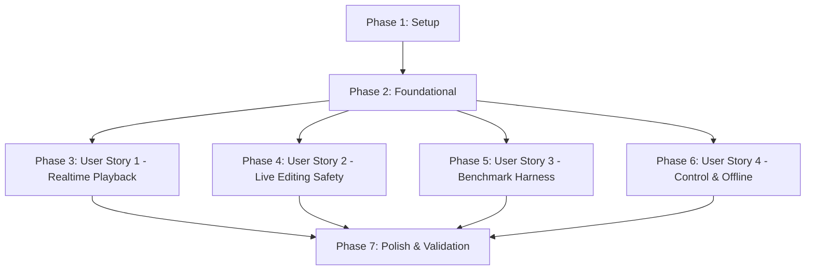

# Tasks: Blue Engine Host Performance and Real-Time Safety

**Input**: Design documents from [`specs/072-blue-engine-performance/`](file:///Users/stevenyi/work/blue-electron/specs/072-blue-engine-performance/)  
**Prerequisites**: [`plan.md`](file:///Users/stevenyi/work/blue-electron/specs/072-blue-engine-performance/plan.md), [`spec.md`](file:///Users/stevenyi/work/blue-electron/specs/072-blue-engine-performance/spec.md), [`research.md`](file:///Users/stevenyi/work/blue-electron/specs/072-blue-engine-performance/research.md), [`data-model.md`](file:///Users/stevenyi/work/blue-electron/specs/072-blue-engine-performance/data-model.md), [`contracts/`](file:///Users/stevenyi/work/blue-electron/specs/072-blue-engine-performance/contracts/)

**Verification**: Follows constitution-required verification: unit tests for all mathematical/quantization transforms, differential Java parity fixtures, AddressSanitizer/ThreadSanitizer concurrency tests, and a 5-trial Release benchmark matrix with automated regression gates.

---

## Phase 1: Setup (Build & Test Infrastructure)

**Purpose**: Establish build targets, compiler presets, and test fixtures for performance work.

- [x] T001 [P] Configure CMake targets and compile definitions for Release performance tracking in `native/blue-engine/CMakeLists.txt`
- [x] T002 [P] Add C++ test fixtures and Java Blue differential test datasets in `native/blue-engine/tests/fixtures/quantization-fixtures.json`
- [x] T003 [P] Add CMake build preset configuration for Release benchmark targets in `native/blue-engine/CMakePresets.json`

---

## Phase 2: Foundational (Blocking Prerequisites)

**Purpose**: Core lock-free generation structures and immutable snapshot models required by all optimizations.

**⚠️ CRITICAL**: Must complete before implementing User Story optimizations.

- [x] T004 Define lock-free snapshot generation counter types and static assertions in `native/blue-engine/src/engine/CsoundEngine.h`
- [x] T005 [P] Add `definitionRevision` tracking and invariant segment cache structures in `native/blue-engine/src/automation/AutomationTypes.h`
- [x] T006 [P] Add `RuntimeChannelBindingSnapshot` and `ShmMirrorBinding` structures in `native/blue-engine/src/engine/CsoundEngine.h`
- [x] T007 Add lock-free revision gating methods in `native/blue-engine/src/automation/AutomationStore.h` and `native/blue-engine/src/automation/AutomationStore.cpp`

**Checkpoint**: Core data structures and atomic revision primitives ready.

---

## Phase 3: User Story 1 - Sustain Predictable Realtime Playback (Priority: P1) 🎯 MVP

**Goal**: Eliminate library mutex contention and invariant math overhead from the steady-state k-cycle audio loop (`performThread()`), deduplicate shared-memory mirroring, and ensure lock-free execution for static and running performances.

**Independent Test**: Build and run Release workloads with 0, 32, 128, and 256 mirrored channels; verify that static channels produce 0 atomic stores, exponential/quantized curves execute with precomputed math, completed envelopes bypass evaluation, and no library mutex locks (`__sp_mut::lock`) occur during steady-state playback.

### Verification for User Story 1

- [x] T008 [P] [US1] Add unit tests for segment invariant math and exponential `logRatio` caching in `native/blue-engine/tests/cpp/test_automation_manager.cpp`
- [x] T009 [P] [US1] Add unit tests for high-precision quantization against Java Blue differential fixtures in `native/blue-engine/tests/cpp/test_automation_fixedpoint.cpp`
- [x] T010 [P] [US1] Add unit tests for shared-memory relaxed ordering and IEEE 754 bitwise deduplication in `native/blue-engine/tests/cpp/test_channel_bridge.cpp`

### Implementation for User Story 1

- [x] T011 [US1] Implement generation-gated `shared_ptr` snapshot acquisition in `native/blue-engine/src/automation/AutomationManager.h` and `native/blue-engine/src/automation/AutomationManager.cpp`
- [x] T012 [US1] Implement segment invariant caching (`invDuration`, `deltaValue`, `logRatio`) in `native/blue-engine/src/automation/AutomationManager.cpp`
- [x] T013 [US1] Implement precomputed quantization constants and integer-scaled fixed-point caching in `native/blue-engine/src/automation/AutomationManager.cpp`
- [x] T014 [US1] Implement definition-aware completed-envelope early-out bypass in `native/blue-engine/src/automation/AutomationManager.cpp`
- [x] T015 [US1] Implement relaxed atomic ordering and IEEE 754 bitwise deduplication in `native/blue-engine/src/engine/CsoundEngine.cpp` and `native/blue-engine/src/ipc/SharedMemory.cpp`
- [x] T016 [US1] Relax independent loop-control telemetry atomics (`shouldStop_`, `sampleNumber_`) in `native/blue-engine/src/engine/CsoundEngine.cpp`

**Checkpoint**: Realtime perform loop runs completely lock-free with precomputed automation invariants and deduplicated shared-memory sync.

---

## Phase 4: User Story 2 - Edit a Running Performance Safely (Priority: P1)

**Goal**: Allow live automation edits (~30 Hz), live orchestra compilation, channel addition/removal, reset, seek, and stop during active playback without audio-thread mutex contention, dangling pointer dereferences, or lost control values.

**Independent Test**: Run a performance while streaming live automation updates and recompiling orchestras; verify under ThreadSanitizer that unresolved channels do not trigger per-cycle mutex locks, recompiled channels safely rebind, and 0 data races or stale pointer crashes occur.

### Verification for User Story 2

- [x] T017 [P] [US2] Add unit tests for automation definition revision invalidation upon live edits and rewinds in `native/blue-engine/tests/cpp/test_automation_manager.cpp`
- [x] T018 [P] [US2] Add multi-threaded race condition tests for concurrent automation modifications in `native/blue-engine/tests/cpp/test_automation_fixedpoint_simple.cpp`
- [x] T019 [US2] Implement definition revision bumping and lock-free publication in `native/blue-engine/src/automation/AutomationStore.cpp`
- [x] T020 [US2] Implement immutable `RuntimeChannelBindingSnapshot` swap in `native/blue-engine/src/engine/CsoundEngine.cpp`
- [x] T021 [US2] Eliminate `channelMutex_` fallback acquisition from the audio thread in `native/blue-engine/src/engine/CsoundEngine.cpp` and `native/blue-engine/src/automation/AutomationManager.cpp`
- [x] T022 [US2] Coordinate live orchestra recompilation (`compileOrc`), reset, and restart with safe snapshot publication in `native/blue-engine/src/engine/CsoundEngine.cpp`
- [x] T023 [US2] Ensure complete final channel value publication before stop/completion reporting in `native/blue-engine/src/engine/CsoundEngine.cpp`

**Checkpoint**: Live editing, live recompilation, and lifecycle transitions operate safely without audio-thread locks.

---

## Phase 5: User Story 3 - Trust Performance Claims and Regressions (Priority: P2)

**Goal**: Provide a reproducible Release benchmark harness and automated pass/fail regression gate across the full workload matrix, retaining machine-readable trial evidence.

**Independent Test**: Run `benchmark_engine` with 5 trials per scenario against a baseline artifact; verify that statistical percentiles (avg, p95, max, spikes) are calculated, output JSON matches `benchmark-matrix-schema.json`, and regression gates (>=10% improvement, <=5% regression) are evaluated.

### Verification for User Story 3

- [x] T024 [P] [US3] Add validation tests for benchmark output schema conformance in `native/blue-engine/tests/cpp/test_csound_probe.cpp`

### Implementation for User Story 3

- [x] T025 [US3] Implement benchmark workload scenario generator and statistical analyzer in `native/blue-engine/src/benchmark_main.cpp` using the instrumented `CsoundEngine` path
- [x] T026 [US3] Implement standalone benchmark CLI executable (`benchmark_engine`) in `native/blue-engine/src/benchmark_main.cpp`
- [x] T027 [US3] Implement automated gate evaluation comparing candidate JSON against baseline JSON in `native/blue-engine/src/benchmark_main.cpp` and `native/blue-engine/scripts/benchmark.mjs`
- [x] T028 [US3] Evaluate optional CMake IPO/LTO (`check_ipo_supported`) and `-fno-math-errno` flags behind benchmark gate in `native/blue-engine/CMakeLists.txt`

**Checkpoint**: Benchmark runner produces deterministic Release evidence and evaluates regression gates.

---

## Phase 6: User Story 4 - Keep Control and Offline Work Responsive (Priority: P3)

**Goal**: Eliminate unnecessary 500 ms polling latency in the control thread and remove per-cycle stderr flushing bottlenecks during message-heavy offline rendering.

**Independent Test**: Measure idle CPU usage and state-event publish latency, and render a message-heavy (100k+ lines) offline CSD; verify that idle latency drops, offline render throughput improves, and 0 diagnostic messages are lost.

### Verification for User Story 4

- [x] T029 [P] [US4] Add unit tests for idle ZeroMQ blocking / in-process wakeup in `native/blue-engine/tests/cpp/test_zmq_idle_wakeup.cpp`
- [x] T030 [P] [US4] Add unit tests for buffered offline batching in `native/blue-engine/tests/cpp/test_csound_runtime_services.cpp`

### Implementation for User Story 4

- [x] T031 [US4] Implement blocking / event-driven poll wakeup on control plane in `native/blue-engine/src/ipc/ZmqHandler.cpp`
- [x] T032 [US4] Implement batched line buffering for offline stderr in `native/blue-engine/src/csound/CsoundRuntimeServices.cpp`

**Checkpoint**: Control plane state transitions notify promptly and offline renders operate without I/O stalls.

---

## Phase 7: Polish & Cross-Cutting Concerns

**Purpose**: Final documentation, end-to-end quickstart validation, and cross-package linting.

- [x] T032-DOC [P] Update architecture documentation in `native/blue-engine/docs/automation_system.md`
- [x] T033 Execute end-to-end quickstart verification workflow per `specs/072-blue-engine-performance/quickstart.md`
- [x] T034 Run full test matrix, lint, and build verification across native and TypeScript packages (`pnpm test && pnpm lint`)

---

## Dependencies & Execution Order

### Phase Dependencies



### User Story Dependencies
- **User Story 1 (P1)**: Depends on Foundational (Phase 2). Delivers core hot-loop speedups.
- **User Story 2 (P1)**: Depends on Foundational (Phase 2) and integrates with US1 generation snapshots.
- **User Story 3 (P2)**: Depends on Foundational (Phase 2). Measures US1 and US2 performance.
- **User Story 4 (P3)**: Depends on Foundational (Phase 2). Independent control and offline improvements.

---

## Parallel Opportunities

- **Phase 1**: All setup tasks (T001, T002, T003) can execute in parallel.
- **Phase 2**: T005 and T006 can execute in parallel.
- **User Story 1**: T008, T009, and T010 verification tests can be created in parallel.
- **User Story 2**: T017 and T018 tests can be created in parallel.
- **Cross-Story**: Once Foundational (Phase 2) completes, User Story 1 (Phase 3), User Story 2 (Phase 4), and User Story 3 (Phase 5) can proceed concurrently.

---

## Parallel Example: User Story 1

```bash
# Launch verification tasks in parallel:
Task: "Add unit tests for segment invariant math in native/blue-engine/tests/cpp/test_automation_manager.cpp"
Task: "Add unit tests for high-precision quantization in native/blue-engine/tests/cpp/test_automation_fixedpoint.cpp"
Task: "Add unit tests for shared-memory relaxed ordering in native/blue-engine/tests/cpp/test_channel_bridge.cpp"
```

---

## Implementation Strategy

### MVP First (User Story 1)
1. Complete Setup (Phase 1) and Foundational (Phase 2).
2. Implement User Story 1 hot-loop optimizations (T008–T016).
3. Validate realtime perform loop lock-freedom and baseline unit tests.

### Incremental Delivery
1. **Increment 1**: Realtime loop lock-freedom & invariant math (User Story 1).
2. **Increment 2**: Live editing safety & fallback mutex removal (User Story 2).
3. **Increment 3**: Release benchmark driver & automated regression gate (User Story 3).
4. **Increment 4**: Event-driven control wakeup & offline message batching (User Story 4).
5. **Increment 5**: End-to-end verification & stress testing (Phase 7).

## Phase 8: Convergence

The implementation review found remaining gaps between the completed task checkboxes and the specification evidence requirements. These tasks are appended without rewriting the prior task history.

- [x] T035 [CRITICAL] Make automation channel bindings generation-aware and coordinate live orchestra compilation, reset, and restart so no cached Csound pointer can be dereferenced after its storage is replaced; add lifecycle assertions and coverage per FR-010/FR-017, US2/AC3, and INV-003 (contradicts).
- [x] T036 [HIGH] Add generation-gated caching for the shared-memory mirror snapshot so unchanged perform cycles do not acquire an atomic shared-pointer load, while preserving release/acquire publication and final flush behavior per FR-009, SC-003, and the snapshot-gating plan decision (partial).
- [x] T037 [HIGH] Route fast and high-precision automation quantization through the prepared per-definition cache, guard invalid resolutions, and expand Java-parity fixtures for negative values, ties, fractional resolutions, and bit-sensitive results per FR-020/FR-021 and T013 (partial).
- [x] T038 [HIGH] Replace the synthetic benchmark with an actual Blue Engine performance-path harness covering the complete channel, automation, live-edit, compile, and missing-binding matrix; enforce warmup, 4,096-period windows, five trials, real metadata, baseline comparison, spike accounting, and computed regression gates per FR-001–FR-008 and T025–T027 (partial).
- [x] T039 [HIGH] Add the missing sanitizer-backed concurrent stress target covering live automation edits, channel removal/rebinding, orchestra compilation, reset, stop, restart, final-value publication, and missing-binding recovery per FR-011/FR-028, SC-006, and US2 (missing).
- [x] T040 [MEDIUM] Add behavioral idle-wakeup and offline-message tests, align the native benchmark CLI with the quickstart's output/compare contract, and fail clearly when benchmark shared-memory setup is unavailable per FR-024/FR-025 and T029 (partial).
