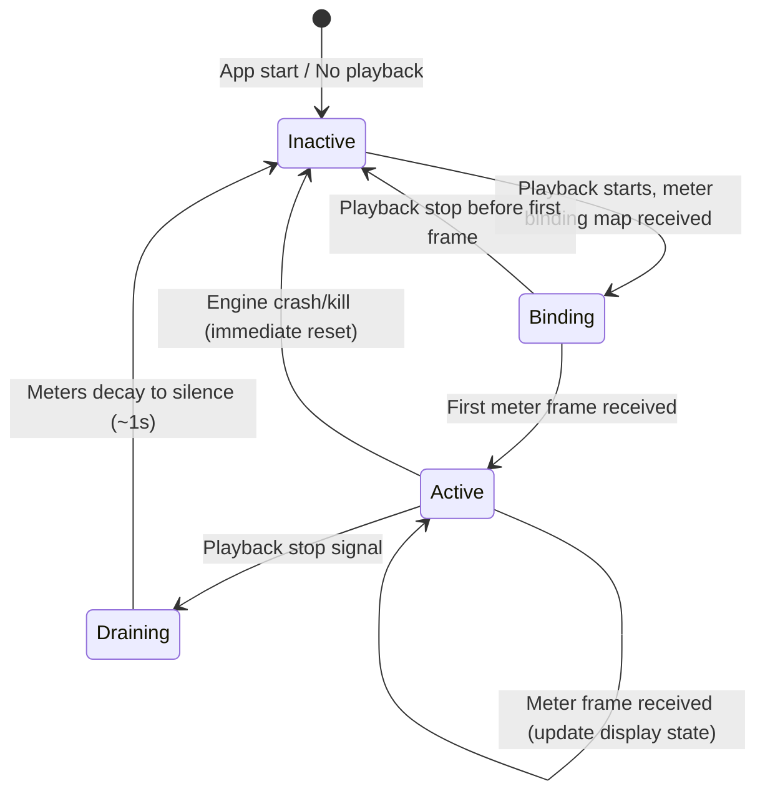
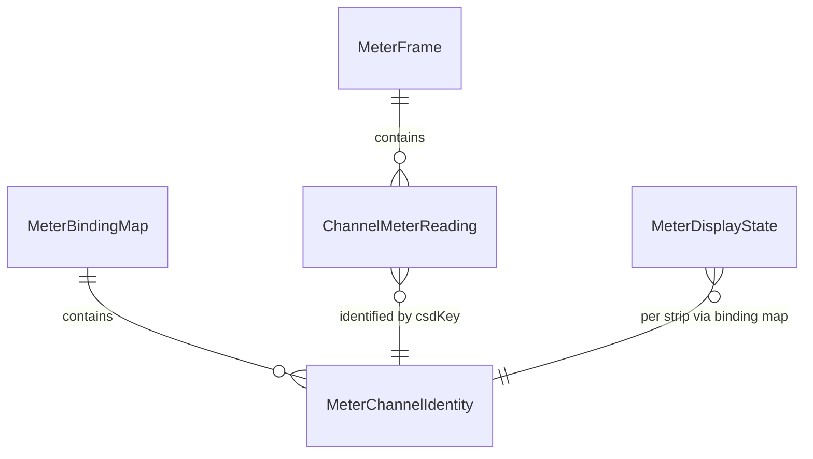

# Data Model: Realtime Mixer Metering

**Branch**: `104-mixer-metering` | **Date**: 2026-09-10

## Entities

### MeterChannelIdentity

Compile-time identity for one metered channel in a playback session.

| Field | Type | Description |
|-------|------|-------------|
| `kind` | `'source' \| 'sub' \| 'master'` | Channel category |
| `csdKey` | `string` | CSD-side identity: numeric string for source (`"0"`, `"1"`…), sanitized name for sub/master (`"Reverb"`, `"Master"`) |
| `stripId` | `string` | UI-side `channel.id` for binding to the mixer strip |
| `displayName` | `string` | Human-readable name for diagnostics |

**Uniqueness**: `csdKey` is unique within a session's meter binding map.

### MeterBindingMap

Session-scoped mapping from CSD meter channel identities to UI strip identities.

| Field | Type | Description |
|-------|------|-------------|
| `entries` | `MeterChannelIdentity[]` | All metered channels in this session |
| `nchnls` | `number` | Project output channel count (determines bars per strip) |

**Lifecycle**: Created during CSD generation. Returned in `RenderCsdResult`. Carried to renderer
at playback start. Discarded on playback stop.

### ChannelMeterReading

Per-channel raw meter observation for one instant.

| Field | Type | Description |
|-------|------|-------------|
| `csdKey` | `string` | Matches `MeterChannelIdentity.csdKey` |
| `rms` | `Float64Array` (length `nchnls`) | Raw windowed RMS values per output channel (linear amplitude, 0.0–1.0+) |
| `peak` | `Float64Array` (length `nchnls`) | Raw windowed peak values per output channel (linear amplitude, 0.0–1.0+) |

**Validation**: Non-finite values (NaN/Infinity) clamped to 0.0 at decode boundary (FR-011).

### MeterFrame

Time-sampled snapshot of all metered channels.

| Field | Type | Description |
|-------|------|-------------|
| `sequence` | `number` | Monotonically increasing frame number; consumers drop stale frames |
| `channels` | `ChannelMeterReading[]` | One entry per metered channel |

**Transport**: Encoded as binary for ZMQ PUB; decoded to structured object at `EngineClient`.

### MeterDisplayState

Renderer-side disposable state per strip. NOT a serialized entity — plain object in the
transient meter store.

| Field | Type | Description |
|-------|------|-------------|
| `barLevels` | `number[]` (length `nchnls`) | Smoothed bar level in dBFS per output channel after decay ballistics |
| `peakHoldLevels` | `number[]` (length `nchnls`) | Peak-hold marker position in dBFS per output channel |
| `peakHoldTimers` | `number[]` (length `nchnls`) | Remaining hold time in ms per output channel |
| `clipFlags` | `boolean[]` (length `nchnls`) | Clip indicator active per output channel |
| `clipTimers` | `number[]` (length `nchnls`) | Remaining clip hold time in ms per output channel |
| `lastUpdateTime` | `number` | `performance.now()` of last rAF update (for delta-time decay) |

**Lifecycle**: Created when playback starts and meter binding map arrives. Updated every rAF.
Reset to silence on playback stop (all levels to `-Infinity`, holds/clips cleared).

## State Transitions

## Relationships

## Persistence

**None.** All entities are transient runtime state:
- `MeterBindingMap` is returned in `RenderCsdResult` (compile output, never serialized to XML)
- `MeterFrame` / `ChannelMeterReading` transit engine → main → renderer, never stored
- `MeterDisplayState` is renderer-side disposable, reset on stop

No `.blue` project XML, program settings, or file store is affected (FR-007, SC-007).
