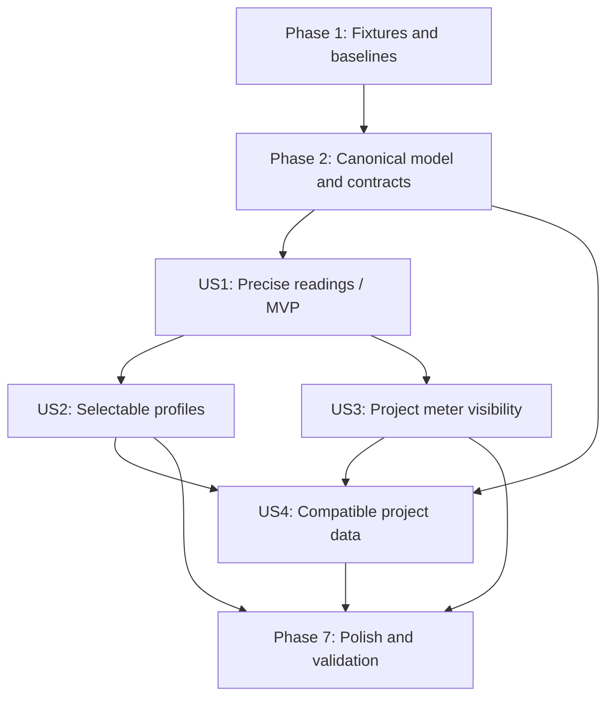

# Tasks: Meter Presentation and Calibration

**Input**: Design documents from `/specs/105-meter-presentation-calibration/`

**Prerequisites**: [plan.md](plan.md), [spec.md](spec.md), [research.md](research.md),
[data-model.md](data-model.md), [contracts/](contracts/), [quickstart.md](quickstart.md)

**Verification**: Tasks include Java/XML compatibility, stable-key contract, project-history
commit→undo→redo, transient meter-state cleanup, Canvas/UI behavior, popout behavior, audio/CSD
non-regression, accessibility, performance, and quickstart validation required by the constitution
and plan.

**Organization**: Tasks are grouped by user story so each story can be implemented and tested as an
increment after the shared canonical contracts are ready.

## Format: `[ID] [P?] [Story] Description`

- **[P]**: Can run in parallel with other tasks in the same phase because it uses different files
  and has no dependency on incomplete work.
- **[Story]**: Maps a task to the user story it serves; setup and foundational tasks intentionally
  have no story label.
- Every task names the concrete repository file or validation artifact it changes.

---

## Phase 1: Setup (Shared Fixtures and Baselines)

**Purpose**: Prepare deterministic fixtures and compatibility evidence before changing the shared
model or renderer.

- [X] T001 [P] Record the Java `<mixer>` child ordering, legacy absence semantics, and existing Spec 104 RMS/peak/CSD baseline in `~/work/nbprojects/blue/blue-core/src/main/java/blue/mixer/Mixer.java`, `.tmp-research/METER_FADE_ROUND2.md`, and `specs/105-meter-presentation-calibration/quickstart.md`
- [X] T002 [P] Add representative new-project, legacy-missing-field, explicit-value, and invalid-profile XML fixture builders to `packages/blue-data/src/mixer/mixer.test.ts`
- [X] T003 [P] Add stable mixer snapshot/channel identity fixtures for docked, detached, and concurrent-view history assertions in `packages/blue-app/src/main/project-history-test-support.ts` and `packages/blue-app/src/renderer/tests/global-project-history-views.test.tsx`

---

## Phase 2: Foundational (Canonical Model, Contracts, and Shared Presentation Primitives)

**Purpose**: Complete the blocking portable-data, boundary-contract, and ProjectHistory work before
story-specific UI behavior begins.

**⚠️ CRITICAL**: No user story implementation can begin until this phase is complete.

- [X] T004 [P] Verify the intentional Java divergence and lossless XML boundary for the two optional mixer presentation children, recording the accepted legacy defaults and unrelated-data preservation rule in `specs/105-meter-presentation-calibration/research.md`
- [X] T005 Define and export the closed `MeterProfileKey` type, five supported keys, new-project defaults, legacy missing-field defaults, accessors, XML serialization/load fallback, and deep-copy/history-copy behavior in `packages/blue-data/src/mixer/mixer.ts` and `packages/blue-data/src/index.ts`
- [X] T006 Add model-level regression coverage for new defaults, independent missing-field defaults, explicit true/false and valid keys, empty/unknown key fallback, stable XML output, unrelated XML preservation, and deep-copy/history-copy isolation in `packages/blue-data/src/mixer/mixer.test.ts`
- [X] T007 Extend `MixerSnapshot`, `MixerPatch`, stable-key validation, and `MIXER_PATCH_PREPARATION_CLASS` with `enableMeters`, `meterProfileKey`, `setMeterEnabled`, and `setMeterProfile` in `packages/blue-app/src/shared/project-editor/contract.ts`
- [X] T008 Publish and project optimistically apply the two canonical fields through empty snapshots, snapshot creation/reconciliation, canonical patch application, and renderer patch projection in `packages/blue-app/src/shared/project-editor/snapshot-mixer-orchestra.ts`, `packages/blue-app/src/shared/project-editor/patch-mixer-bluelive.ts`, `packages/blue-app/src/shared/project-editor/patch-document.ts`, and `packages/blue-app/src/renderer/stores/project-store.ts`
- [X] T009 Extend scalar ProjectHistory preparation, target resolution, forward/inverse patch conversion, rollback, changed-target publication, and semantic action labels for meter visibility/profile fields in `packages/blue-app/src/main/project-history-memento.ts`, `packages/blue-app/src/main/project-history.ts`, and `packages/blue-app/src/shared/project-editor/patch-mixer-bluelive.ts`
- [X] T010 Add focused contract and history tests proving same-value no-ops, typed invalid-key rejection, stable mixer/channel identities, dirty-state transitions, snapshot publication, and exact commit→undo→redo for both scalar patches in `packages/blue-app/src/shared/project-editor/patch-mixer-bluelive.test.ts`, `packages/blue-app/src/renderer/tests/mixer-contract.test.ts`, `packages/blue-app/src/main/project-history-patch-classification.test.ts`, and `packages/blue-app/src/main/project-history-roundtrip.test.ts`
- [X] T011 [P] Implement one immutable renderer-owned profile registry keyed only by `MeterProfileKey`, including labels/descriptions, bounded monotonic mappings, major/minor ticks, color/reference thresholds, RMS-led bars, absolute sample-peak markers, and the K-reference disclaimer in `packages/blue-app/src/renderer/components/workbench/panels/mixer/meter-profiles.ts`
- [X] T012 Add profile-registry tests for all five keys, exact linear landmarks, expanded mixing-range landmarks, K20/K14/K12 zero references, monotonic/clamped/non-finite mapping, tick labels, and replaceable display labels in `packages/blue-app/src/renderer/tests/meter-canvas.test.tsx`

**Checkpoint**: The canonical project fields, typed patch/history routes, and all five deterministic
profile definitions are available without changing engine protocol or audio generation.

---

## Phase 3: User Story 1 - Read Levels Precisely at a Glance (Priority: P1) 🎯 MVP

**Goal**: Add dB reference marks and one accurate held sample-peak readout per strip while retaining
the existing RMS bars, peak holds, and clip indication.

**Independent Test**: Feed known -18 dBFS mono, stereo, and multichannel signals through source,
subchannel, and master strips; verify profile landmarks, one-decimal maximum held peak values,
`-inf` silence output, and strip-local atomic clear by clicking both the meter and readout.

### Verification for User Story 1

- [X] T013 [P] [US1] Add meter-store tests for maximum held sample peak across outputs, one-decimal/`-inf` formatting inputs, non-finite telemetry sanitization, and atomic clearing of all held peaks, markers, and clip flags for only the clicked strip in `packages/blue-app/src/renderer/tests/meter-store.test.ts`
- [X] T014 [P] [US1] Add Canvas tests for default-profile dB landmarks, RMS bar versus absolute peak marker positions, major/minor tick rendering, warning/clip styling, and mono/stereo/multichannel bar layout in `packages/blue-app/src/renderer/tests/meter-canvas.test.tsx`
- [X] T015 [P] [US1] Add mixer-panel tests for numeric readout text, `-inf` silence, maximum-across-channels behavior, and equivalent clear actions from the Canvas and readout in `packages/blue-app/src/renderer/tests/mixer-panel.test.tsx`

### Implementation for User Story 1

- [X] T016 [US1] Extend the imperative meter store with held sample-peak accessors, finite-value aggregation, reusable strip-clear mutation, and reset behavior that preserves no stale peak or clip state in `packages/blue-app/src/renderer/stores/meter-store.ts`
- [X] T017 [US1] Extend `MeterCanvas` to consume a profile definition, draw aligned dB ticks/labels and profile thresholds, retain RMS-led bars and absolute peak markers, expose non-color overload state, and invoke the shared strip-clear action on click in `packages/blue-app/src/renderer/components/workbench/panels/mixer/MeterCanvas.tsx`
- [X] T018 [US1] Extend `ChannelStrip` to show one accessible numeric held sample-peak readout per strip, format finite values to one decimal place or `-inf`, and route readout clicks through the same atomic clear action as the Canvas in `packages/blue-app/src/renderer/components/workbench/panels/mixer/ChannelStrip.tsx`
- [X] T019 [US1] Add a legible aligned scale-ruler layout that survives narrow widths, zoom, horizontal scrolling, and detached hosting without changing fader behavior in `packages/blue-app/src/renderer/components/workbench/panels/MixerPanel.tsx` and `packages/blue-app/src/renderer/styles/index.css`

**Checkpoint**: A fixed-level signal can be read against dB marks, the readout reports the highest
held output peak, and either click target clears only that strip without a project-history entry.

---

## Phase 4: User Story 2 - Choose a Useful Meter Presentation (Priority: P1)

**Goal**: Let users select one project-wide stable-key profile from the meter area and immediately
reposition presentation elements without changing measured values or audio behavior.

**Independent Test**: While fixed signals play, select all five profiles, verify every source,
subchannel, and master view updates together, verify K14 aligns RMS -14 dBFS to displayed zero,
verify absolute peak readouts remain unchanged, then save/reload and undo/redo the selection.

### Verification for User Story 2

- [X] T020 [P] [US2] Add UI tests for a visible current-profile selector, all five stable-key choices, project-wide updates, K-reference explanatory text, accessible state, and no-op re-selection in `packages/blue-app/src/renderer/tests/mixer-panel.test.tsx`
- [X] T021 [P] [US2] Add history-view tests for `Set Meter Profile` commit→undo→redo, dirty-state restoration, open-dialog/view synchronization, and unchanged mixer/channel identities in `packages/blue-app/src/renderer/tests/global-project-history-views.test.tsx` and `packages/blue-app/src/main/global-project-history.test.ts`
- [X] T022 [P] [US2] Add presentation-only regression tests comparing profile changes before/after generated CSD, offline render inputs, fader values, automation, routing, and absolute peak data in `packages/blue-data/src/blue-data-csd-parity.test.ts`, `packages/blue-data/src/blue-data-csd-disk.test.ts`, and `packages/blue-app/src/renderer/tests/mixer-contract.test.ts`

### Implementation for User Story 2

- [X] T023 [US2] Add the meter-area profile selector, stable-key dispatch, current-selection display, and semantic `Set Meter Profile` patch flow in `packages/blue-app/src/renderer/components/workbench/panels/MixerPanel.tsx` and `packages/blue-app/src/renderer/components/workbench/panels/mixer/ChannelStrip.tsx`
- [X] T024 [US2] Pass the canonical profile key through every source, subchannel, and master meter and make profile changes update ticks, labels, mappings, colors, markers, and thresholds without restarting playback in `packages/blue-app/src/renderer/components/workbench/panels/mixer/MeterCanvas.tsx` and `packages/blue-app/src/renderer/components/workbench/panels/mixer/meter-profiles.ts`
- [X] T025 [US2] Add K20/K14/K12 accessible descriptions that state the level-reference purpose and explicitly disclaim monitor SPL, hardware, room, or speaker calibration in `packages/blue-app/src/renderer/components/workbench/panels/mixer/meter-profiles.ts` and `packages/blue-app/src/renderer/components/workbench/panels/MixerPanel.tsx`

**Checkpoint**: All five profiles are selectable by stable key, persist through the canonical patch
path, update every visible mixer surface, and leave audio/CSD/absolute readings unchanged.

---

## Phase 5: User Story 3 - Control Meter Visibility per Project (Priority: P1)

**Goal**: Add the far-right Mixer Settings gear and a host-document dialog for project-owned Enable
Meters, with new-project and legacy behavior, immediate multi-view updates, and transient cleanup.

**Independent Test**: Exercise a new project, a legacy project without the fields, and an explicitly
configured project in docked and detached mixers; open the gear, toggle Enable Meters, save/reload,
and undo/redo while verifying visibility, dialog state, dirty state, and unchanged audio.

### Verification for User Story 3

- [X] T026 [P] [US3] Add tests for new-project enabled defaults, legacy-missing-field disabled defaults, explicit persisted values, gear placement after the master, keyboard reachability, dialog contents, and no-op close behavior in `packages/blue-app/src/renderer/tests/mixer-panel.test.tsx`
- [X] T027 [P] [US3] Add docked/detached host-document tests for opening and closing Mixer Settings, dialog focus, checkbox synchronization, and profile/visibility consistency across popout lifecycle in `packages/blue-app/src/renderer/tests/mixer-meter-popout.test.tsx`
- [X] T028 [P] [US3] Add history-view tests for `Enable Meters`/`Disable Meters` semantic actions, immediate snapshot publication, open-dialog reconciliation, dirty-state undo/redo, and same-value no-op behavior in `packages/blue-app/src/renderer/tests/global-project-history-views.test.tsx` and `packages/blue-app/src/main/global-project-history.test.ts`
- [X] T029 [P] [US3] Add runtime regression coverage proving disabled meters stop Canvas animation/repaint and clear transient state while mixer routing, faders, effects, automation, realtime playback, generated CSD, and audible output remain unchanged in `packages/blue-app/src/renderer/browser/mixer-metering.browser.test.tsx`, `packages/blue-app/src/main/meter-engine.integration.test.ts`, and `packages/blue-data/src/blue-data-csd-parity.test.ts`

### Implementation for User Story 3

- [X] T030 [US3] Create the host-document `MixerSettingsDialog` with title, project-ownership explanation, only the Enable Meters checkbox, close action, accessible labeling, visible focus, and immediate scalar patch dispatch in `packages/blue-app/src/renderer/components/workbench/panels/mixer/MixerSettingsDialog.tsx`
- [X] T031 [US3] Place the keyboard-accessible named Mixer Settings gear in a fixed rail after the master strip and open the dialog through the invoking docked or detached host document in `packages/blue-app/src/renderer/components/workbench/panels/MixerPanel.tsx`
- [X] T032 [US3] Derive meter visibility from the canonical `MixerSnapshot.enableMeters` for all strip kinds, removing bars, ticks, readouts, and meter-only controls without disabling the mixer or fader in `packages/blue-app/src/renderer/components/workbench/panels/MixerPanel.tsx` and `packages/blue-app/src/renderer/components/workbench/panels/mixer/ChannelStrip.tsx`
- [X] T033 [US3] Clear all disposable meter holds/clip flags and cancel Canvas animation when meters become disabled, restart from silence when re-enabled, and keep telemetry handling on the existing typed engine/preload contract in `packages/blue-app/src/renderer/stores/meter-store.ts`, `packages/blue-app/src/renderer/components/workbench/panels/mixer/MeterCanvas.tsx`, and `packages/blue-app/src/main/main.ts`
- [X] T034 [US3] Add responsive, focus-visible, non-color-dependent styling for the far-right gear, settings dialog, profile/visibility controls, and disabled-meter layout in `packages/blue-app/src/renderer/styles/index.css`

**Checkpoint**: Meter visibility is a project-history setting, the gear/dialog work in docked and
detached views, disabling stops display work and clears stale state, and audio remains unaffected.

---

## Phase 6: User Story 4 - Preserve Compatible Project Data (Priority: P2)

**Goal**: Round-trip new and legacy mixer presentation values without losing unrelated project data,
stable identities, or Java-compatible audio/CSD behavior.

**Independent Test**: Load representative legacy, explicit, invalid/future-key, and new fixtures;
save/reload and copy/history-restore them; compare mixer/audio state, unknown content, CSD output,
and all visible views.

### Verification for User Story 4

- [x] T035 [P] [US4] Add legacy, explicit, invalid/future-key, and unknown-content round-trip assertions that verify only stable keys appear in XML and unrelated mixer/project fields survive in `packages/blue-data/src/mixer/mixer.test.ts` and `packages/blue-data/src/blue-data-root-compatibility.test.ts`
- [x] T036 [P] [US4] Add copy, duplication, history restore, snapshot publication, and concurrent-view assertions for canonical presentation values and unchanged channel identities/references in `packages/blue-app/src/shared/project-editor/identity.test.ts`, `packages/blue-app/src/main/project-history-roundtrip.test.ts`, and `packages/blue-app/src/renderer/tests/global-project-history-views.test.tsx`
- [x] T037 [P] [US4] Add byte-identical CSD/disk-render regression coverage across all five profiles and both visibility values, including a Java-compatible legacy fixture, in `packages/blue-data/src/blue-data-csd-parity.test.ts` and `packages/blue-data/src/blue-data-csd-disk.test.ts`
- [x] T038 [P] [US4] Add load/save and detached-view integration coverage proving profile labels can change without migration while persisted stable keys still select the same presentation in `packages/blue-app/src/renderer/tests/mixer-contract.test.ts` and `packages/blue-app/src/renderer/tests/mixer-meter-popout.test.tsx`

### Implementation for User Story 4

- [x] T039 [US4] Finalize XML load/save and root XML policy integration so optional mixer children use the specified absence defaults, invalid keys fall back safely, and existing modeled/unmodeled content is not rewritten in `packages/blue-data/src/mixer/mixer.ts` and `packages/blue-data/src/blue-data/xml-policy.ts`
- [x] T040 [US4] Finalize boundary normalization so visual labels never enter XML, patches, snapshots, history records, or runtime selection and future/unknown keys cannot block project load in `packages/blue-app/src/shared/project-editor/contract.ts`, `packages/blue-app/src/renderer/stores/project-store.ts`, and `packages/blue-app/src/shared/project-editor/patch-mixer-bluelive.ts`

**Checkpoint**: Legacy and new projects load safely, stable keys round-trip, unknown/unrelated data
is retained according to existing XML policy, and presentation settings have no audio-side effects.

---

## Phase 7: Polish & Cross-Cutting Verification

**Purpose**: Close constitution and plan obligations across accessibility, performance, documentation,
and repository validation.

- [x] T041 [P] Add browser accessibility coverage for the gear, profile selector, scale labels, peak readout, overload state, dialog focus, and keyboard operation in `packages/blue-app/src/renderer/browser/accessibility-focus.browser.test.tsx` and `packages/blue-app/src/renderer/browser/accessibility-contrast.browser.test.tsx`
- [x] T042 [P] Add a production-style mounted mixer performance test proving disabled meters schedule no Canvas animation/repaint and enabled meters preserve the existing frame cadence without React updates per telemetry frame in `packages/blue-app/src/renderer/browser/mixer-metering.browser.test.tsx`
- [x] T043 Run the focused feature validation from `specs/105-meter-presentation-calibration/quickstart.md`, including `@blue/data` mixer tests, the renderer meter/contract/panel/popout tests, global-history verification, main/renderer builds, and `git diff --check`, then record dated evidence in `specs/105-meter-presentation-calibration/quickstart.md`
- [x] T044 Run repository-wide `pnpm test`, `pnpm lint`, and `git diff --check` from `/Users/stevenyi/work/blue-electron`, and resolve or document any scoped platform-specific exception in `specs/105-meter-presentation-calibration/quickstart.md`

---

## Dependencies & Execution Order

### Phase Dependencies

- **Phase 1 (Setup)**: No dependencies; T001–T003 can start immediately.
- **Phase 2 (Foundational)**: Depends on Phase 1 and blocks all story work; complete the portable
  model and tests before shared contract consumers.
- **Phase 3 (US1)**: Depends on Phase 2 and is the MVP increment.
- **Phase 4 (US2)**: Depends on Phase 2 and the meter rendering surface from US1; it can begin once
  T017–T019 expose a profile-aware meter.
- **Phase 5 (US3)**: Depends on Phase 2 and the US1 meter surface; it can proceed in parallel with
  US2 after T017–T019.
- **Phase 6 (US4)**: Data compatibility tests can begin after Phase 2; multi-view/persistence
  checks depend on the relevant US2/US3 UI surfaces.
- **Phase 7 (Polish)**: Depends on all desired stories and their focused tests being complete.

### User Story Dependency Graph



### Parallel Opportunities

- **Phase 1**: T001, T002, and T003 touch separate baseline/fixture areas and can run in parallel.
- **Phase 2**: After T005, T007 and T011 can proceed in parallel; T006, T010, and T012 are
  independently runnable verification work once their target contracts exist.
- **US1**: T013, T014, and T015 are separate test surfaces and can be prepared in parallel; T016
  and T017 can then proceed independently before T018/T019 integrate them.
- **US2**: T020, T021, and T022 can run in parallel; the selector wiring in T023 and rendering in
  T024 are separate component concerns after the tests are in place.
- **US3**: T026–T029 are independent UI/history/runtime verification tasks; T030, T032, and T033
  can be split by dialog, visibility projection, and transient-store lifecycle.
- **US4**: T035–T038 can run in parallel across data, history/identity, CSD, and renderer popout
  coverage.
- **Polish**: T041 and T042 can run in parallel before the serial quickstart/full-suite checks.

### Within Each User Story

- Write or extend the focused regression/contract tests before implementation where the harness
  supports it.
- Keep project-owned values in the canonical `BlueData`/snapshot/patch/history path; keep held
  peaks, clip flags, open dialogs, labels, and animation state transient.
- Complete model/contract work before UI integration and complete core rendering before popout or
  full-workbench integration.
- A story is complete only when its independent test criteria pass without relying on a later story.

---

## Parallel Example: User Story 1

```text
Task T013: Extend meter-store tests in packages/blue-app/src/renderer/tests/meter-store.test.ts
Task T014: Extend Canvas tests in packages/blue-app/src/renderer/tests/meter-canvas.test.tsx
Task T015: Extend panel tests in packages/blue-app/src/renderer/tests/mixer-panel.test.tsx
```

## Parallel Example: User Story 2

```text
Task T020: Profile-selector UI tests in packages/blue-app/src/renderer/tests/mixer-panel.test.tsx
Task T021: Profile history tests in packages/blue-app/src/main/global-project-history.test.ts
Task T022: Audio/CSD non-regression tests in packages/blue-data/src/blue-data-csd-parity.test.ts
```

## Parallel Example: User Story 3

```text
Task T026: Gear/dialog tests in packages/blue-app/src/renderer/tests/mixer-panel.test.tsx
Task T027: Host-document popout tests in packages/blue-app/src/renderer/tests/mixer-meter-popout.test.tsx
Task T029: Disabled-meter runtime/performance tests in packages/blue-app/src/renderer/browser/mixer-metering.browser.test.tsx
```

## Parallel Example: User Story 4

```text
Task T035: XML compatibility tests in packages/blue-data/src/mixer/mixer.test.ts
Task T036: Copy/history identity tests in packages/blue-app/src/main/project-history-roundtrip.test.ts
Task T037: Byte-identical CSD tests in packages/blue-data/src/blue-data-csd-parity.test.ts
Task T038: Detached label/key tests in packages/blue-app/src/renderer/tests/mixer-meter-popout.test.tsx
```

---

## Implementation Strategy

### MVP First (User Story 1 Only)

1. Complete Phase 1 fixture and Java-baseline setup.
2. Complete Phase 2 canonical model, boundary contracts, scalar history, and profile registry.
3. Complete Phase 3 US1 meter-store, Canvas, ChannelStrip, and scale-ruler work.
4. **STOP and VALIDATE**: run the US1 focused tests with fixed mono/stereo/multichannel signals.
5. Demo the precise readout/clear behavior before adding persistence controls.

### Incremental Delivery

1. Add US2 profile selection and presentation-only switching; validate stable-key persistence and
   audio/CSD identity.
2. Add US3 Mixer Settings, new/legacy defaults, multi-view synchronization, and disabled-meter
   cleanup.
3. Add US4 compatibility/unknown-content/copy/history/CSD evidence.
4. Run accessibility, performance, quickstart, affected-package, and repository-wide validation.

### Scope Guardrails

- Do not add new meter measurements, true peak/LUFS/VU/PPM ballistics, engine messages, fader
  taper changes, per-strip persisted profiles, or a general plugin/curve framework.
- Do not persist display labels or transient meter state.
- Do not bypass `ProjectHistory` for either durable setting.

---

## Notes

- `[P]` tasks use separate files or verification surfaces and have no dependency on incomplete work.
- `[US1]` through `[US4]` map directly to the prioritized stories in `spec.md`.
- The proposed MVP is US1 after the shared foundation; US2 and US3 are both P1 follow-on slices,
  while US4 is the P2 compatibility hardening slice.

## Phase 8: Convergence

- [X] T045 Align the keyboard-accessible Mixer Settings gear to the far right of the mixer toolbar header row with flexible space after Add Subchannel, remove the playing badge from the toolbar, and verify layout across docked and detached views in `packages/blue-app/src/renderer/components/workbench/panels/MixerPanel.tsx`, `packages/blue-app/src/renderer/styles/index.css`, and `packages/blue-app/src/renderer/tests/mixer-panel.test.tsx` per FR-009 and US3/AC4
- [X] T046 Move the Meter Profile selector and K-reference description into the Mixer Settings dialog (disabled when meters disabled), add "Disable Meters" action and profile checkmark indicators to the strip meter context menu, order Peak/RMS (+6 dBFS) first and Peak/RMS Linear (+6 dBFS) second with Linear as legacy default and Peak/RMS as new-project default, and verify tests in `packages/blue-app/src/renderer/components/workbench/panels/mixer/MixerSettingsDialog.tsx`, `packages/blue-app/src/renderer/components/workbench/panels/MixerPanel.tsx`, `packages/blue-app/src/renderer/components/workbench/panels/mixer/ChannelStrip.tsx`, and `packages/blue-app/src/renderer/tests/mixer-panel.test.tsx` per FR-008, FR-010, and FR-013

## Phase 9: Convergence

- [X] T047 Move the keyboard-accessible Mixer Settings gear from the toolbar into a far-right mixer-content rail after the master strip, preserving reachability through normal horizontal scrolling, zoom, docked, and detached views, and update the corresponding layout and tests in `packages/blue-app/src/renderer/components/workbench/panels/MixerPanel.tsx`, `packages/blue-app/src/renderer/styles/index.css`, `packages/blue-app/src/renderer/tests/mixer-panel.test.tsx`, and `packages/blue-app/src/renderer/tests/mixer-meter-popout.test.tsx` per FR-009 and US3/AC4 (partial)
- [X] T048 Remove the Meter Profile selector and K-reference description from Mixer Settings so its initial general-setting surface contains only Enable Meters and explanatory text, retain profile selection and the K-reference explanation in the meter interaction surface, and update dialog, context-menu, accessibility, and popout tests in `packages/blue-app/src/renderer/components/workbench/panels/mixer/MixerSettingsDialog.tsx`, `packages/blue-app/src/renderer/components/workbench/panels/MixerPanel.tsx`, `packages/blue-app/src/renderer/components/workbench/panels/mixer/ChannelStrip.tsx`, `packages/blue-app/src/renderer/tests/mixer-panel.test.tsx`, `packages/blue-app/src/renderer/tests/mixer-meter-popout.test.tsx`, `packages/blue-app/src/renderer/browser/accessibility-focus.browser.test.tsx`, and `packages/blue-app/src/renderer/browser/accessibility-contrast.browser.test.tsx` per FR-010 and spec Assumptions (contradicts)

## Phase 10: User-Directed Layout Preference

- [X] T049 Restore the keyboard-accessible Mixer Settings gear to its preferred location at the far right of the mixer toolbar after Add Subchannel, remove the superseded post-master rail, update the focused layout test, and record the preferred placement in the feature specification, plan, research, UI contract, and quickstart per FR-009 and US3/AC4
